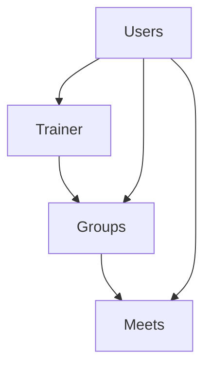

# SoluTrain

## Requirements

* conda - For managing python environment
* docker
* docker compose

## Installation

Run the following commands to install:

```bash
git clone git@github.com:omer-priel/solutrain.git
cd solutrain

conda env create -f environment.yml
conda activate solutrain

cd backend
poetry install
```

## Get Started

For starting the database run in a terminal the following commands:

```bash
docker-compose up -d db
```

For running the backend run in a terminal the following commands:

```bash
python -m src
```

And open in a browser the localhost:8000/docs

## CI

For running the Formaters and Linters run in a terminal the following commands:

```bash
make fix-lint
```

For cleaning the cache run in a terminal the following commands:

```bash
make clean
```

## Testing - TODO

For running the tests run in a terminal the following commands:

```bash
```

## Doucmentation - TODO 

* Superuser
* Manager
* Customer

### Diagrams

Database



Network diagram flow


## License

MIT

## Author

* Dor
* Omer Priel
* Ori Sharaby
* Stav Avitan
* Stav Sharon
