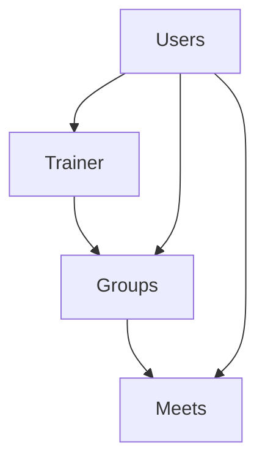

# SoluTrain

## Requirements

* conda - For managing python environment
* docker
* docker compose

## Installation

Run the following commands to install:

```bash
git clone git@github.com:omer-priel/solutrain.git
cd solutrain
```

## Get Started

For running the backend run in a terminal the following commands:

```bash
```

## CI

For running the Formaters and Linters run in a terminal the following commands:

```bash
```

For cleaning the cache run in a terminal the following commands:

```bash
```

## Testing

For running the tests run in a terminal the following commands:

```bash
```

## Doucmentation - TODO 

* Superuser
* Manager
* Customer

### Diagrams

Database



Network diagram flow


## License

MIT

## Author

Dor
Omer Priel
Ori Sharaby
Stav Avitan
Stav Sharon001
