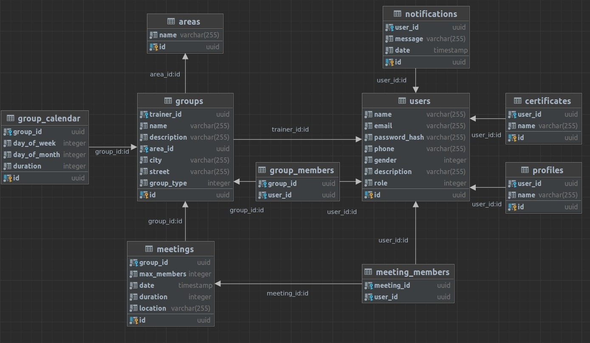
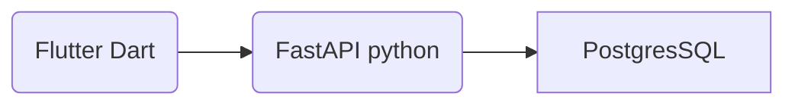

# SoluTrain

## Requirements

* conda - For managing python environment
* docker
* docker compose
* flutter
* Android Studio

## Installation

Run the following commands to install:

```bash
git clone git@github.com:omer-priel/solutrain.git
cd solutrain

conda env create -f environment.yml
conda activate solutrain

cd backend
poetry install
```

## Environment Variables

Table of the reqired environment variables for the backend:

| Variable    | Description               |
|-------------|---------------------------|
| PG_DATABASE | PostgresSQL database name |
| PG_USER     | PostgresSQL user          |
| PG_PASSWORD | PostgresSQL password      |
| PG_HOST     | PostgresSQL host          |

Table of the optional environment variables for the backend:

| Variable | Description      | Default |
|----------|------------------|---------|
| PG_PORT  | PostgresSQL port | 5432    |

For local development add .env file to backend directory that contains the environment variables. \
Exists .env.example file as example.

## Get Started

For starting the database run in a terminal the following commands:

```bash
docker-compose up -d db
```

For create the tables in the database run in a terminal the following commands:

```bash
cd backend
python -m src migrate
```

For running the backend run in a terminal the following commands:

```bash
python -m src
```

And open in a browser the localhost:8000/docs

## CI

For running the Formaters and Linters run in a terminal the following commands:

```bash
make fix-lint
```

For cleaning the cache run in a terminal the following commands:

```bash
make clean
```

For rebuild the database run in a terminal the following commands:

```bash
docker-compose rm -f -s db
docker-compose up -d db
sleep 1
cd backend
python -m src migrate
```

### Diagrams

Database



Network diagram flow



## License

MIT

## Author

* Dor
* Omer Priel
* Ori Sharaby
* Stav Avitan
* Stav Sharon
