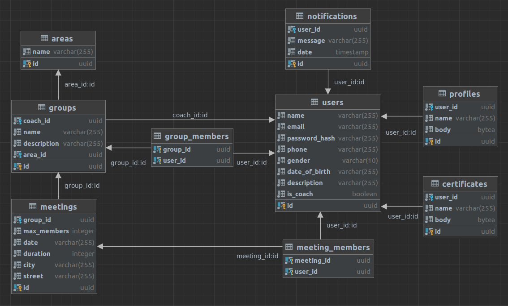

# SoluTrain

## Requirements

* conda
* docker
* docker compose
* flutter
* Android Studio

## Technologies

* python - As programming language for the backend
* conda - For managing python environment
* poetry - For managing python dependencies
* FastAPI - As framework for the backend
* PostgresSQL - As database
* docker - For development in production of the backend
* docker compose - For local development
* flutter - As framework for the mobile app
* Dart - As programming language for the mobile app

## Installation

Run the following commands to install:

```bash
git clone git@github.com:omer-priel/solutrain.git
cd solutrain

conda env create -f environment.yml
conda activate solutrain

cd backend
poetry install
```

## Environment Variables

### Backend

Table of the required environment variables for the backend:

| Variable    | Description               |
|-------------|---------------------------|
| PG_DATABASE | PostgresSQL database name |
| PG_USER     | PostgresSQL user          |
| PG_PASSWORD | PostgresSQL password      |
| PG_HOST     | PostgresSQL host          |

Table of the optional environment variables for the backend:

| Variable | Description      | Default |
|----------|------------------|---------|
| PG_PORT  | PostgresSQL port | 5432    |

For local development add .env file to backend directory that contains the environment variables. \
Exists .env.example file as example.

### Mobile

Table of the optional environment variables for the mobile:

| Variable     | Description          | Default                        |
|--------------|----------------------|--------------------------------|
| API_IS_HTTPS | API is HTTPS of HTTP | true                           |
| API_HOST     | API host             | solutrain-backend.onrender.com |
| API_PORT     | API port             | 443                            |

For local development in Android Studio you can change the environment variables, in the configuration. \
Recommended to add different configuration for production and local development.

## Files Structure

Note: the **API** means the backend and the **app** means the mobile app.

* backend - The Backend API Service
  * src - The source code
    * models - The models of Database for handling the communication with the database
    * routers - The routers of the API
    * __main__.py - The entry point for running the API
    * app.py - The FastAPI application
    * config.py - The configuration of the API
    * exceptions.py - The exceptions of the API
    * logger.py - The logger of the API and handler logging related
    * migrations.py - The migrations of the database
    * security.py - The security of the API, authentication and hashing
  * .env - Environment variables file
  * .env.example - Example of the environment variables file
  * Dockerfile - Dockerfile for building the image of the API
  * poetry.lock - Poetry lock file, for managing the dependencies (changed only by poetry)
  * pyproject.toml - Poetry project file, for managing the dependencies
* mobile - The Mobile App
  * android - The Android App, for customiztion for Android
  * ios - The iOS App, for customiztion for iOS
  * lib - The source code
    * pages - Pages of the app
    * widgets - Cusotom reusable widgets for the app
    * api.dart - Handling the communication with the API
    * config.dart - The configuration of the app
    * main.dart - The entry point for the app
    * schemas.dart - The schemas of the API
  * test - The tests of the app (not implemented yet)
  * .env - Environment variables file for local development only. Can be loaded by Android Studio
  * pubspec.lock - Pubspec lock file, for managing the dependencies (changed only by pub)
  * pubspec.yaml - Pubspec project file, for managing the dependencies
* scripts - Scripts for development in the project
  * clean.sh - Cleaning the cache of the project
  * fix-lint.sh - Run the formatters and the Linters of the project, for CI.
  * fix.sh - Run the formatters of the project for cleaning the code, for CI.
  * lint.sh - Run the Linters of the project for checking the code, for CI.
* environment.yml - Conda environment file
* database-diagram.jpeg - Database diagram
* docker-compose.yml - Docker compose file for local development
* LICENSE - License file
* README.md - This file

## Diagrams

Database



Network diagram flow


Modules diagram


Pages diagram


* Note: Any page can navigate to the Profile page.

## Get Started

For starting the database run in a terminal the following commands:

```bash
docker-compose up -d db
```

For create the tables in the database run in a terminal the following commands:

```bash
cd backend
python -m src migrate
```

For running the backend run in a terminal the following commands:

```bash
python -m src
```

And open in a browser the localhost:8000/docs

## CI

For running the Formaters and Linters run in a terminal the following commands:

```bash
make fix-lint
```

For cleaning the cache run in a terminal the following commands:

```bash
make clean
```

For rebuild the database run in a terminal the following commands:

```bash
docker-compose rm -f -s db
docker-compose up -d db
sleep 1
cd backend
python -m src migrate
```

## License

MIT

## Author

* Dor
* Omer Priel
* Ori Sharaby
* Stav Avitan
* Stav Sharon
